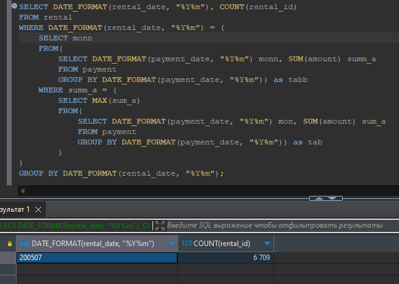

# Домашнее задание к занятию «SQL. Часть 2»

### Инструкция по выполнению домашнего задания

1. Сделайте fork [репозитория c шаблоном решения](https://github.com/netology-code/sys-pattern-homework) к себе в Github и переименуйте его по названию или номеру занятия, например, https://github.com/имя-вашего-репозитория/gitlab-hw или https://github.com/имя-вашего-репозитория/8-03-hw).
2. Выполните клонирование этого репозитория к себе на ПК с помощью команды `git clone`.
3. Выполните домашнее задание и заполните у себя локально этот файл README.md:
   - впишите вверху название занятия и ваши фамилию и имя;
   - в каждом задании добавьте решение в требуемом виде: текст/код/скриншоты/ссылка;
   - для корректного добавления скриншотов воспользуйтесь инструкцией [«Как вставить скриншот в шаблон с решением»](https://github.com/netology-code/sys-pattern-homework/blob/main/screen-instruction.md);
   - при оформлении используйте возможности языка разметки md. Коротко об этом можно посмотреть в [инструкции по MarkDown](https://github.com/netology-code/sys-pattern-homework/blob/main/md-instruction.md).
4. После завершения работы над домашним заданием сделайте коммит (`git commit -m "comment"`) и отправьте его на Github (`git push origin`).
5. Для проверки домашнего задания преподавателем в личном кабинете прикрепите и отправьте ссылку на решение в виде md-файла в вашем Github.
6. Любые вопросы задавайте в чате учебной группы и/или в разделе «Вопросы по заданию» в личном кабинете.

Желаем успехов в выполнении домашнего задания.

---

Задание можно выполнить как в любом IDE, так и в командной строке.

### Задание 1

Одним запросом получите информацию о магазине, в котором обслуживается более 300 покупателей, и выведите в результат следующую информацию: 
- фамилия и имя сотрудника из этого магазина;
- город нахождения магазина;
- количество пользователей, закреплённых в этом магазине.

```
SELECT staff.first_name, staff.last_name, city.city, COUNT(cust.customer_id) 
FROM store
JOIN staff ON store.manager_staff_id = staff.staff_id 
JOIN address addr ON store.address_id = addr.address_id 
JOIN city ON addr.city_id = city.city_id 
JOIN customer cust ON store.store_id = cust.store_id 
GROUP BY store.store_id 
HAVING COUNT(cust.customer_id) > 300;
```


### Задание 2

Получите количество фильмов, продолжительность которых больше средней продолжительности всех фильмов.

```
SELECT COUNT(film_id) 
FROM film 
WHERE `length` > (SELECT AVG(`length`) FROM film);
```


### Задание 3

Получите информацию, за какой месяц была получена наибольшая сумма платежей, и добавьте информацию по количеству аренд за этот месяц.

```
SELECT DATE_FORMAT(rental_date, "%Y%m"), COUNT(rental_id)
FROM rental
WHERE DATE_FORMAT(rental_date, "%Y%m") = (
	SELECT monn
	FROM(
		SELECT DATE_FORMAT(payment_date, "%Y%m") monn, SUM(amount) summ_a
		FROM payment
		GROUP BY DATE_FORMAT(payment_date, "%Y%m")) as tabb
	WHERE summ_a = (
		SELECT MAX(sum_a)
		FROM(
			SELECT DATE_FORMAT(payment_date, "%Y%m") mon, SUM(amount) sum_a
			FROM payment
			GROUP BY DATE_FORMAT(payment_date, "%Y%m")) as tab
		) 
)
GROUP BY DATE_FORMAT(rental_date, "%Y%m");
```



## Дополнительные задания (со звёздочкой*)
Эти задания дополнительные, то есть не обязательные к выполнению, и никак не повлияют на получение вами зачёта по этому домашнему заданию. Вы можете их выполнить, если хотите глубже шире разобраться в материале.

### Задание 4*

Посчитайте количество продаж, выполненных каждым продавцом. Добавьте вычисляемую колонку «Премия». Если количество продаж превышает 8000, то значение в колонке будет «Да», иначе должно быть значение «Нет».

```
SELECT s.first_name, s.last_name, COUNT(p.payment_id),
	CASE 
		WHEN COUNT(p.payment_id) > 8000 THEN 'Да'
		ELSE 'Нет'
	END AS 'Премия'	
FROM staff s
JOIN payment p ON p.staff_id = s.staff_id 
GROUP BY s.staff_id ;
```


### Задание 5*

Найдите фильмы, которые ни разу не брали в аренду.

```
SELECT f.title
FROM film f 
LEFT JOIN inventory i ON i.film_id = f.film_id 
LEFT JOIN rental r ON r.inventory_id = i.inventory_id 
WHERE r.rental_id IS NULL;
```
